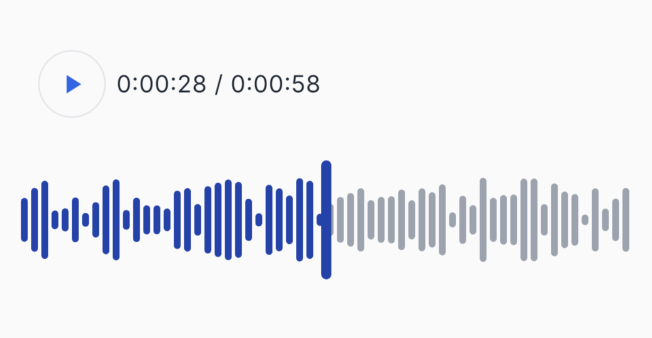

# Audio Waveform View

A Flutter package that provides a customizable waveform visualization for audio playback. This package allows you to render beautiful waveform displays with progress indicators, ideal for audio player interfaces.

## Features

- Customizable played and unplayed waveform colors
- Visual progress indicator with custom thumb
- Dynamic waveform generation
- Smooth rendering with custom painting
- Responsive design that adapts to available space

## Screenshots

<!-- Add your screenshots here -->


## Installation

Add `audio_waveform_view` to your `pubspec.yaml`:

```yaml
dependencies:
  audio_waveform_view: ^1.0.0
```

Run:

```bash
flutter pub get
```

## Usage

Basic implementation:

```dart
  SizedBox(
    height: 70,
    width: 400,
    child: CustomPaint(
      painter:WaveformPainter(
        progress: 0.666665,
        playedColor: Colors.blue, 
        unplayedColor: Colors.grey,
          max: 1.0, 
          min: 0.0
        ),
    )
  )
```

## Parameters

| Parameter | Type | Description |
|-----------|------|-------------|
| `progress` | `double` | The current progress value between `min` and `max` |
| `playedColor` | `Color` | The color used for the played portion of the waveform |
| `unplayedColor` | `Color` | The color used for the unplayed portion of the waveform |
| `max` | `double` | The maximum value for the progress range |
| `min` | `double` | The minimum value for the progress range |
| `thumbColor` | `Color?` | The color of the progress indicator thumb (defaults to `playedColor` if not specified) |
